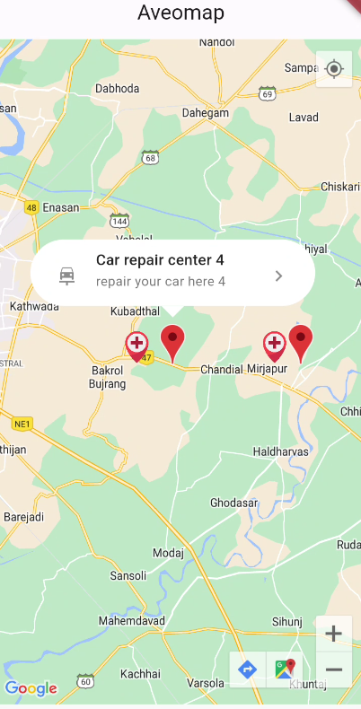

# AveoMap

AveoMap helps simplify adding markers on map.

## What you Save
- If you integrate map module with marker and custom floating infowindow from the scratch it can take upto 20-30hrs to make it done. But Wait You have Aveomap Right?? so your time will reduces to only 30-60mins!!!

## Getting Started


- [Configration for ANDROID](#android)
- [Configration for IOS](#ios)
- [Usage example](#sample-usage)
- [Where to use](#where-it-can-be-used)
- [Why to use](#why-to-use)


### Android
1 Set the minSdkVersion in android/app/build.gradle:
```groovy
android {
    defaultConfig {
        minSdkVersion 20
    }
}
```
This means that app will only be available for users that run Android SDK 20 or higher.

2 Specify your API key and give location permission in the application manifest android/app/src/main/AndroidManifest.xml:

```xml
<manifest ...
  <application ...
    <meta-data android:name="com.google.android.geo.API_KEY"
               android:value="YOUR KEY HERE"/>
    ...
        
    <uses-permission android:name="android.permission.ACCESS_FINE_LOCATION" />
```


### IOS
To set up, specify your API key in the application delegate ios/Runner/AppDelegate.m:

```objectivec
#include "AppDelegate.h"
#include "GeneratedPluginRegistrant.h"
#import "GoogleMaps/GoogleMaps.h"

@implementation AppDelegate

- (BOOL)application:(UIApplication *)application
    didFinishLaunchingWithOptions:(NSDictionary *)launchOptions {
  [GMSServices provideAPIKey:@"YOUR KEY HERE"];
  [GeneratedPluginRegistrant registerWithRegistry:self];
  return [super application:application didFinishLaunchingWithOptions:launchOptions];
}
@end
```
Or in your swift code, specify your API key in the application delegate ios/Runner/AppDelegate.swift:

```swift
import UIKit
import Flutter
import GoogleMaps

@UIApplicationMain
@objc class AppDelegate: FlutterAppDelegate {
  override func application(
    _ application: UIApplication,
    didFinishLaunchingWithOptions launchOptions: [UIApplication.LaunchOptionsKey: Any]?
  ) -> Bool {
    GMSServices.provideAPIKey("YOUR KEY HERE")
    GeneratedPluginRegistrant.register(with: self)
    return super.application(application, didFinishLaunchingWithOptions: launchOptions)
  }
}
```
for location permission add `NSLocationWhenInUseUsageDescription` key to your
   `Info.plist` file. This will automatically prompt the user for permissions
   when the map tries to turn on the My Location layer

## Sample Usage
there are two ways to show diffrent markers in this package you can either use JSON(in predefined format) or you can provide `List<AveoMarker>` inside widget.



1 with List of aveoMarker
```dart
AveoMap(
              myLocationEnabled: true,
              myLocationButtonEnabled: true,
              zoom: 11,
              infoTap: (element) {
                print(element);
              },
              markerList: [
                AveoMarker(
                    position: MarkerPosition(23.00, 72.76),
                    markerIconImage:
                        'https://cdn-icons-png.flaticon.com/512/3448/3448513.png',
                    infoLeadingWidget: Icon(Icons.car_rental),
                    infoTitle: 'Car repiar center',
                    infoSubTitle: 'repair your car here 1',
                    infoTralingWidget: Icon(Icons.navigate_next_sharp)),
                AveoMarker(
                    position: MarkerPosition(23.00, 72.8596),
                    markerIconImage:
                        'https://www.freeiconspng.com/thumbs/restaurant-icon-png/pink-restaurants-icon-19.png',
                    infoLeadingWidget: Icon(Icons.hotel),
                    infoTitle: 'Car repiar center 2',
                    infoSubTitle: 'repair your car here 2',
                    infoTralingWidget: Icon(Icons.navigate_next_sharp)),
                AveoMarker(
                    position: MarkerPosition(23.00, 72.8786),
                    markerIconImage: '',
                    infoLeadingWidget: Icon(
                      Icons.pedal_bike_sharp,
                    ),
                    infoTitle: 'Car repiar center 3',
                    infoSubTitle: 'repair your car here 3',
                    infoTralingWidget: Icon(Icons.navigate_next_sharp)),
                AveoMarker(
                    position: MarkerPosition(23.00, 72.786),
                    markerIconImage: '',
                    infoLeadingWidget: Icon(Icons.local_hospital),
                    infoTitle: 'Car repiar center 4',
                    infoSubTitle: 'repair your car here 4',
                    infoTralingWidget: Icon(Icons.navigate_next_sharp)),
              ],
            );
```


2 with jsonData,
formate of json should be stricly as below

```json
[ {

"lat": "latitude",

"long": "longitude",

"img": "Marker icon",

"title":"Title of infowindow",

"sub_title":"subTitle of infoWindow",

"leading":"leading image url of infoWindow",

"traling":"traling image url of infoWindow"

}, ...(other markers to be shown as above)

]
```

```dart
 AveoMap(
              myLocationEnabled: true,
              myLocationButtonEnabled: true,
              zoom: 11,
              infoTap: (element) {
                print(element);
              },
              markerListJson: your JSON,
            );
```
## Where it can be used?

- Show list of your operating center inside map like locations of your shops,mall,offices, etc.
- To give information about your location 
- To show directions of your location 

## Why to use?
- This plugin simplifies the process of integrating google map inside app.
- gives meaningful infowindow which if not directly supported by googlemap.


